# Cloudflare Infrastructure as Code - Technical Documentation

## Table of Contents

1. [Executive Summary](#executive-summary)
2. [Architecture Overview](#architecture-overview)
3. [System Components](#system-components)
4. [Directory Structure](#directory-structure)
5. [Configuration Scopes](#configuration-scopes)
6. [Platform Management](#platform-management)
7. [Deployment Workflow](#deployment-workflow)
8. [Security & Credentials](#security--credentials)
9. [AWX Integration](#awx-integration)
10. [Operational Procedures](#operational-procedures)
11. [Troubleshooting Guide](#troubleshooting-guide)
12. [Best Practices](#best-practices)

---

## Executive Summary

This document describes the Cloudflare Infrastructure as Code (IaC) solution built on Ansible and AWX. The system provides automated, auditable, and repeatable deployments of Cloudflare configurations across multiple environments and platforms.

### Key Features

- **Multi-Region Support**: Manage configurations across geographically distributed data centers
- **Environment Segregation**: Separate configurations for production, staging, test, and global environments
- **Configuration Scopes**: Granular control over DNS, domain security, network settings, and notifications
- **Dry-Run Mode**: Preview changes before deployment
- **Audit Trail**: All deployments require ticket numbers for change tracking
- **Dynamic Discovery**: Automatic platform detection from filesystem structure
- **Idempotent Operations**: Safe to run repeatedly without side effects

### Technology Stack

- **Automation Engine**: Ansible 2.20.0
- **Orchestration Platform**: AWX 24.6.1
- **Version Control**: Git (GitHub)
- **API Integration**: Cloudflare REST API v4
- **Template Engine**: Jinja2 3.1.6

---

## Architecture Overview

### High-Level Architecture


### Data Flow

1. **User Input**: Operator selects deployment parameters via AWX survey
2. **Inventory Selection**: AWX loads region-specific inventory (e.g., IOM)
3. **Platform Discovery**: System auto-detects available platform configurations
4. **Configuration Loading**: Platform-specific YAML files are merged with base configuration
5. **Validation**: Credentials, zone access, and configuration syntax are validated
6. **Dry-Run** (Optional): Preview changes without applying them
7. **Deployment**: Apply changes to Cloudflare via REST API
8. **Verification**: Confirm successful deployment and generate summary

---

## System Components

### 1. Inventory Structure

The inventory is organized by **region** (geographic datacenter location). Each region is a separate inventory in Ansible.

#### Example: IOM (Isle of Man) Inventory

```
inventories/IOM/
├── hosts                          # Ansible inventory file
└── group_vars/
    ├── all/
    │   ├── cloudflare.yml        # Cloudflare API configuration
    │   ├── credentials.yml       # Encrypted secrets (Ansible Vault)
    │   └── platforms/            # Platform-specific configurations
    │       ├── production/       # Live production platforms
    │       │   ├── L008.yml
    │       │   ├── L016.yml
    │       │   └── L019.yml
    │       ├── staging/          # Pre-production staging
    │       │   ├── S009.yml
    │       │   └── S016.yml
    │       ├── global/           # Shared/global services
    │       │   ├── G000.yml
    │       │   └── G255.yml
    │       └── test/             # Development/testing
    │           └── T009.yml
    └── kafka_broker/             # Service-specific configs
        └── kafka_feature_topics.yml
```

#### Inventory Host File

**File**: `inventories/IOM/hosts`

```ini
[cloudflare]
cloudflare-manager ansible_host=localhost ansible_connection=local

[ansible]
cloudflare-manager
```

### 2. Platform Configuration Files

Each platform is defined in a YAML file containing environment-specific settings.

#### Platform File Structure

**File**: `inventories/IOM/group_vars/all/platforms/staging/S009.yml`

```yaml
---
platform_id: "S009"
platform_type: "staging"
platform_domain: "example-domain.com"

# IP address mappings for services
ipAddresses:
  gameflex: "<IP_ADDRESS>"
  backoffice: "<IP_ADDRESS>"
  webapi: "<IP_ADDRESS>"
  gamemanager: "<IP_ADDRESS>"

# Platform-specific Cloudflare settings
cloudflare_domain_cache_rules:
  - name: "bypass-test-pages"
    expression: '(http.request.uri.path contains "TestPage.html")'
    action: "bypass_cache"
    
cloudflare_dns_records:
  - name: "api-{{ platform_id | lower }}"
    type: "A"
    content: "{{ ipAddresses.webapi }}"
    proxied: true
    comment: "S009 - API service (staging environment)"
```

#### Platform Naming Convention

| Prefix | Environment | Description | Example |
|--------|-------------|-------------|---------|
| **L** | Production (Live) | Customer-facing production systems | L008, L016, L019 |
| **S** | Staging | Pre-production validation environment | S009, S016, S017 |
| **T** | Test | Development and testing | T009 |
| **G** | Global | Shared services across all platforms | G000, G255 |
| **P** | Pre-Production | Final validation before production | P009, P016 |

### 3. Global Configuration Files

#### Cloudflare API Configuration

**File**: `inventories/IOM/group_vars/all/cloudflare.yml`

```yaml
---
cloudflare_api_url: "https://api.cloudflare.com/client/v4"

# Region identifier
region: "IOM"

# Default zone (can be overridden by platform)
cloudflare_zone_name: "example-domain.com"

# Feature toggles
cloudflare_dns_enabled: true
cloudflare_domain_enabled: true
cloudflare_network_enabled: true
cloudflare_notifications_enabled: true
```

#### Credentials (Encrypted)

**File**: `inventories/IOM/group_vars/all/credentials.yml` (Ansible Vault encrypted)

```yaml
---
# Cloudflare API credentials
cloudflare_api_email: "admin@example.com"
cloudflare_api_key: "{{ vault_cloudflare_api_key }}"
cloudflare_account_id: "{{ vault_cloudflare_account_id }}"

# AWX credentials
awx_username: "{{ vault_awx_username }}"
awx_password: "{{ vault_awx_password }}"
```

---

## Configuration Scopes

The system supports four distinct configuration scopes, each managing specific aspects of Cloudflare infrastructure.

### 1. DNS Scope

**Purpose**: Manage DNS records for the zone

**Capabilities**:
- Create/update A, AAAA, CNAME, TXT, MX records
- Configure DNS proxying (orange cloud)
- Set TTL values
- Add descriptive comments
- Automatic record discovery from platform configuration

**Configuration Location**: `roles/linux/cloudflare/cloudflare/vars/dns.yml`

**Example Configuration**:

```yaml
---
cloudflare_dns_records:
  # DNS records can be defined globally or per-platform
  # Platform-specific records override global definitions
  
  # Example: Root domain
  - name: "@"
    type: "A"
    content: "<IP_ADDRESS>"
    proxied: true
    ttl: 1  # Automatic TTL
    comment: "Root domain - load balanced entry point"
```

**Dynamic DNS Record Generation**:

The system automatically generates DNS records from the platform's `ipAddresses` dictionary:

```yaml
# In platform file: S009.yml
ipAddresses:
  webapi: "<IP_ADDRESS>"
  gameflex: "<IP_ADDRESS>"

# Auto-generated DNS records:
# - webapi-s009.example-domain.com → <IP_ADDRESS>
# - gameflex-s009.example-domain.com → <IP_ADDRESS>
```

### 2. Domain Scope

**Purpose**: Configure zone-level security, performance, and caching

**Capabilities**:
- **SSL/TLS Settings**: Certificate management, encryption mode, TLS versions
- **Cache Rules**: Define caching behavior via Cloudflare Rulesets API
- **Argo Smart Routing**: Enable intelligent traffic routing
- **Argo Tiered Caching**: Multi-tier cache hierarchy
- **DNSSEC**: DNS Security Extensions configuration
- **Page Rules**: Legacy page rule management
- **Origin Settings**: Origin server connection configuration
- **Onion Routing**: Tor network access

**Configuration Location**: `roles/linux/cloudflare/cloudflare/vars/domain.yml`

**Example Configuration**:

```yaml
---
# Argo Smart Routing (performance optimization)
cloudflare_domain_argo:
  smart_routing: true
  tiered_caching: true

# Cache Rules (modern rulesets API)
cloudflare_domain_cache_rules:
  - name: "bypass-test-pages"
    description: "Bypass cache for test pages"
    expression: '(http.request.uri.path contains "TestPage.html")'
    action: "set_cache_settings"
    action_parameters:
      cache: false
      browser_ttl:
        mode: "override_origin"
        default: 30
    enabled: true

  - name: "cache-static-assets"
    description: "Cache all HTML files"
    expression: '(http.request.uri.path.extension eq "html")'
    action: "set_cache_settings"
    action_parameters:
      cache: true
      edge_ttl:
        mode: "override_origin"
        default: 300
      browser_ttl:
        mode: "override_origin"
        default: 300
    enabled: true

# DNSSEC configuration
cloudflare_domain_dnssec:
  enabled: true
```

**Cache Rules Architecture**:

Cache rules use Cloudflare's new Rulesets API, which provides:
- Expression-based rule matching
- Priority-based rule ordering
- Complex logical conditions
- Granular cache control
- Browser and edge TTL separation

### 3. Network Scope

**Purpose**: Configure network-level settings and monitoring

**Capabilities**:
- **Health Checks**: Monitor service availability across multiple regions
- **IPv6 Support**: Enable/disable IPv6 connectivity
- **WebSockets**: Enable persistent connection support
- **Pseudo IPv4**: Add IPv4 headers for IPv6-only origins
- **IP Geolocation**: Add country/location headers to requests

**Configuration Location**: `roles/linux/cloudflare/cloudflare/vars/network.yml`

**Example Configuration**:

```yaml
---
# Network settings
cloudflare_network_settings:
  ipv6: true
  websockets: true
  pseudo_ipv4: "off"  # Options: "off", "add_header", "overwrite_header"
  ip_geolocation: true

# Health check defaults
cloudflare_network_health_checks_enabled: true
cloudflare_network_health_checks_defaults:
  type: "https"
  path: "/health"
  port: 443
  interval: 60          # Check every 60 seconds
  retries: 2           # Number of retries before marking unhealthy
  timeout: 5           # Connection timeout in seconds
  expected_codes: "200"
  check_regions: ["WEU", "ENAM"]  # Western Europe, Eastern North America
```

**Dynamic Health Check Generation**:

Health checks are automatically created from the platform's DNS records:

```yaml
# Platform DNS records generate health checks:
# - gameflex-s009.example-domain.com/health
# - webapi-s009.example-domain.com/health
# - gamemanager-s009.example-domain.com/health

# Each health check monitors:
# - Service availability (HTTP 200 response)
# - Response time
# - Regional availability (WEU, ENAM)
```

### 4. Notifications Scope

**Purpose**: Configure alerting and monitoring notifications

**Capabilities**:
- **Email Destinations**: Send alerts to email addresses
- **Webhook Destinations**: POST alerts to HTTP endpoints
- **PagerDuty Integration**: Create incidents in PagerDuty
- **Alert Policies**: Define what events trigger notifications
- **Health Check Alerts**: Monitor health check status changes

**Configuration Location**: `roles/linux/cloudflare/cloudflare/vars/notifications.yml`

**Example Configuration**:

```yaml
---
cloudflare_notifications:
  enabled: true
  
  # Notification policies
  policies:
    - name: "SSL Certificate Expiration"
      alert_type: "ssl_certificate_expiration"
      enabled: true
      filters:
        days_before_expiration: [30, 14, 7]
      
    - name: "Health Check Status"
      alert_type: "health_check_status_notification"
      enabled: true
      filters:
        status: ["Healthy", "Unhealthy"]
      
    - name: "DDoS Attack Detected"
      alert_type: "ddos_attack"
      enabled: true

  # Email destinations (account members)
  email_recipients:
    - "ops-team@example.com"
    - "platform-alerts@example.com"

  # Webhook destinations
  webhooks:
    - name: "Slack Operations Channel"
      url: "https://hooks.slack.com/services/XXX/YYY/ZZZ"
      secret: "{{ vault_slack_webhook_secret }}"
```

**Available Alert Types**:

| Category | Alert Type | Description |
|----------|-----------|-------------|
| **Health Checks** | health_check_status_notification | Service availability changes |
| **SSL/TLS** | ssl_certificate_expiration | Certificate expiring soon |
| **Security** | ddos_attack | DDoS attack detected |
| **Security** | waf_rule_triggered | WAF rule matched |
| **DNS** | dns_record_change | DNS configuration modified |
| **Zone** | zone_configuration_change | Zone settings updated |

---

## Platform Management

### Platform Discovery Process

The system automatically discovers available platforms from the filesystem:

```mermaid
flowchart TD
    Start([Platform Discovery Start])
    
    Scan["📁 Scan Directories"]
    Prod["production/<br/>L008.yml, L016.yml, L019.yml"]
    Stage["staging/<br/>S009.yml, S016.yml"]
    Global["global/<br/>G000.yml, G255.yml"]
    Test["test/<br/>T009.yml"]
    
    Extract["🔍 Extract Platform IDs<br/>L008.yml → L008"]
    
    Sort["📊 Sort Platforms<br/>By: Prefix (G, L, P, S, T)<br/>Then: Numeric value"]
    
    Present["📋 AWX Survey Dropdown<br/>G000, G255, L008, L016, L019<br/>S009, S016, T009"]
    
    Start --> Scan
    Scan --> Prod
    Scan --> Stage
    Scan --> Global
    Scan --> Test
    
    Prod --> Extract
    Stage --> Extract
    Global --> Extract
    Test --> Extract
    
    Extract --> Sort
    Sort --> Present
    
    style Start fill:#e1f5ff
    style Scan fill:#fff4e6
    style Extract fill:#f3e5f5
    style Sort fill:#e8f5e9
    style Present fill:#fce4ec
```



### Platform Configuration Loading

**Execution Flow**:

```mermaid
flowchart TD
    Step1["👤 User Selection<br/>Region=IOM, Platform=S009"]
    
    Step2["📂 Load Base Configuration<br/>- cloudflare.yml<br/>- credentials.yml (encrypted)"]
    
    Step3["🔍 Discover Platform File<br/>Search: platforms/*/S009.yml<br/>Found: platforms/staging/S009.yml"]
    
    Step4["📄 Load Platform Config<br/>- platform_id: S009<br/>- platform_type: staging<br/>- platform_domain: example-domain.com<br/>- ipAddresses: {...}"]
    
    Step5["🔀 Merge Configurations<br/>Platform overrides base<br/>effective_zone_name = platform_domain || cloudflare_zone_name"]
    
    Step6["⚙️ Generate Dynamic Resources<br/>- DNS records from ipAddresses<br/>- Health checks from DNS records"]
    
    Step7["✅ Validate and Deploy<br/>Apply changes to Cloudflare"]
    
    Step1 --> Step2
    Step2 --> Step3
    Step3 --> Step4
    Step4 --> Step5
    Step5 --> Step6
    Step6 --> Step7
    
    style Step1 fill:#e3f2fd
    style Step2 fill:#f3e5f5
    style Step3 fill:#fff9c4
    style Step4 fill:#c8e6c9
    style Step5 fill:#ffe0b2
    style Step6 fill:#b2dfdb
    style Step7 fill:#c5cae9
```



### Platform Isolation

Each platform maintains complete isolation:

```yaml
# Platform S009 configuration is completely independent from S016
# Changes to S009 do NOT affect:
# - Other staging platforms (S016, S017)
# - Production platforms (L008, L016)
# - Global services (G000, G255)
```

---

## Deployment Workflow

### Standard Deployment Process

#### Step 1: Access AWX Interface

```
URL: https://awx.example.com/
Credentials: Use LDAP/SSO or local AWX account
```

#### Step 2: Navigate to Job Template

```
Navigation: Resources → Templates → Cloudflare-Deployment
Action: Click "Launch" button
```

#### Step 3: Complete Survey Questions

```mermaid
flowchart LR
    subgraph Survey["📋 Cloudflare DNS Management Survey"]
        direction TB
        Q1["1️⃣ Ticket Number: JIRA-1234<br/>Enter the ticket/change request number"]
        Q2["2️⃣ Region: IOM ▼<br/>Options: IOM, TEST"]
        Q3["3️⃣ Platform Selection: S009 ▼<br/>Options: G000, G255, L008, L016, S009, S016, T009"]
        Q4["4️⃣ Configuration Scope: dns ▼<br/>Options: dns, domain, network, notifications"]
        Q5["5️⃣ Dry Run Mode: On ▼<br/>Options: On (preview), Off (deploy)"]
        
        Q1 --> Q2
        Q2 --> Q3
        Q3 --> Q4
        Q4 --> Q5
    end
    
    Q5 --> Action{Action}
    Action -->|Cancel| C[❌ Cancel]
    Action -->|Launch| L[✅ Launch Template]
    
    style Survey fill:#e3f2fd
    style Q1 fill:#fff9c4
    style Q2 fill:#fff9c4
    style Q3 fill:#fff9c4
    style Q4 fill:#fff9c4
    style Q5 fill:#fff9c4
    style L fill:#c8e6c9
    style C fill:#ffcdd2
```



#### Step 4: Review Dry-Run Output (Optional)

**Dry-Run Mode Benefits**:
- Preview all changes before deployment
- Validate configuration syntax
- Verify platform detection
- Review DNS records to be created
- Check health check endpoints
- Confirm no unintended changes

**Example Dry-Run Output**:

```
TASK [cloudflare dns | Display dry-run changes] ****************************
ok: [cloudflare-manager] => {
    "msg": [
        "DRY RUN MODE: The following changes would be applied:",
        "",
        "DNS Records to be created:",
        "  - webapi-s009.example-domain.com (A) → <IP_ADDRESS>",
        "  - gameflex-s009.example-domain.com (A) → <IP_ADDRESS>",
        "  - gamemanager-s009.example-domain.com (A) → <IP_ADDRESS>",
        "",
        "Total records: 3",
        "",
        "No changes will be made to Cloudflare (dry run mode enabled)"
    ]
}
```

#### Step 5: Execute Deployment

Set **Dry Run Mode** to **Off** and re-launch to apply changes.

#### Step 6: Verify Deployment

**AWX Job Output**:

```
PLAY [Cloudflare Configuration Deployment] ********************************

TASK [cloudflare | Store original dry-run mode from survey] ***************
ok: [cloudflare-manager]

TASK [cloudflare | Display deployment banner] *****************************
ok: [cloudflare-manager] => {
    "msg": [
        "======================================================================",
        "Cloudflare Deployment",
        "======================================================================",
        "Ticket: JIRA-1234",
        "Region: IOM",
        "Platform: S009 (staging)",
        "Scope: dns",
        "Zone: example-domain.com",
        "Dry Run: false",
        "======================================================================"
    ]
}

TASK [cloudflare dns | Create or update DNS records] **********************
changed: [cloudflare-manager] => (item=webapi-s009)
changed: [cloudflare-manager] => (item=gameflex-s009)
changed: [cloudflare-manager] => (item=gamemanager-s009)

TASK [cloudflare dns | Display DNS changes made] **************************
ok: [cloudflare-manager] => {
    "msg": [
        "webapi-s009.example-domain.com: CREATED successfully",
        "gameflex-s009.example-domain.com: CREATED successfully",
        "gamemanager-s009.example-domain.com: CREATED successfully"
    ]
}

TASK [cloudflare | Display completion summary] ****************************
ok: [cloudflare-manager] => {
    "msg": [
        "======================================================================",
        "Deployment Summary",
        "======================================================================",
        "Status: SUCCESS",
        "Platform: S009",
        "Zone: example-domain.com",
        "Changes applied:",
        "  ✓ DNS records (3 created)",
        "",
        "Verify your changes:",
        "  Dashboard: https://dash.cloudflare.com/",
        "  Domain: example-domain.com",
        "======================================================================"
    ]
}

PLAY RECAP *****************************************************************
cloudflare-manager : ok=15   changed=1   failed=0   skipped=5
```

**Cloudflare Dashboard Verification**:

1. Login to Cloudflare Dashboard: https://dash.cloudflare.com/
2. Select Account and Zone
3. Navigate to **DNS** → **Records**
4. Verify new/updated records appear with correct values
5. Check **Audit Log** for API activity

---

## Security & Credentials

### Credential Management

#### Ansible Vault Encryption

All sensitive data is encrypted using Ansible Vault:

```bash
# Encrypt credentials file
ansible-vault encrypt inventories/IOM/group_vars/all/credentials.yml

# Edit encrypted file
ansible-vault edit inventories/IOM/group_vars/all/credentials.yml

# Decrypt for viewing (not recommended for production)
ansible-vault decrypt inventories/IOM/group_vars/all/credentials.yml
```

#### AWX Credential Types

The system uses custom credential types in AWX:

**1. Cloudflare API Credential**:

```yaml
Name: Cloudflare API
Fields:
  - cloudflare_api_email (string)
  - cloudflare_api_key (secret)
  - cloudflare_account_id (string)

Injectors:
  Environment Variables:
    CLOUDFLARE_API_EMAIL: "{{ cloudflare_api_email }}"
    CLOUDFLARE_API_KEY: "{{ cloudflare_api_key }}"
    CLOUDFLARE_ACCOUNT_ID: "{{ cloudflare_account_id }}"
  
  Extra Variables:
    cloudflare_api_email: "{{ cloudflare_api_email }}"
    cloudflare_api_key: "{{ cloudflare_api_key }}"
    cloudflare_account_id: "{{ cloudflare_account_id }}"
```

**2. AWX Cluster Authentication** (for multi-AWX environments):

```yaml
Name: AWX Cluster Authentication
Fields:
  - awx_cluster_url (string)
  - awx_cluster_username (string)
  - awx_cluster_password (secret)
  - awx_cluster_verify_ssl (boolean)
```

### API Security

#### Cloudflare API Access

- **Authentication Method**: Global API Key (not API Token)
- **Required Permissions**: 
  - Zone Settings: Read & Edit
  - DNS: Read & Edit
  - SSL/TLS: Read & Edit
  - Firewall: Read & Edit
  - Health Checks: Read & Edit
  - Notifications: Read & Edit

#### API Rate Limiting

Cloudflare enforces rate limits:

```
Default Rate Limit: 1200 requests per 5 minutes
Status Header: ratelimit: "default";r=1199;t=1

Handling:
- Ansible will automatically retry on 429 errors
- Tasks are designed to minimize API calls
- Bulk operations where possible
```

### Access Control

#### Role-Based Access (RBAC)

AWX provides granular access control:

```mermaid
flowchart TD
    Org["🏢 Organization: Default"]
    
    Admin["👑 Admin<br/>Full access to all resources"]
    Operator["⚙️ Operator<br/>Execute job templates<br/>View results"]
    Auditor["👁️ Auditor<br/>Read-only access to jobs<br/>and inventories"]
    Read["📖 Read<br/>View job templates<br/>and inventories"]
    
    Org --> Admin
    Org --> Operator
    Org --> Auditor
    Org --> Read
    
    style Org fill:#e3f2fd
    style Admin fill:#ffcdd2
    style Operator fill:#c8e6c9
    style Auditor fill:#fff9c4
    style Read fill:#b2dfdb
```



#### Audit Trail

All deployments are audited:

```yaml
Audit Information:
  - Ticket Number: JIRA-1234
  - User: john.doe@example.com
  - Timestamp: 2026-02-04 10:30:15 UTC
  - Region: IOM
  - Platform: S009
  - Scope: dns
  - Dry Run: false
  - Job ID: 416
  - Status: successful
  - Changes: 3 DNS records created
```

---

## AWX Integration

### Project Configuration

**Project Settings**:

```yaml
Name: Cloudflare-DevOps
Description: Cloudflare DNS and configuration management from Git
Organization: Default
SCM Type: Git
SCM URL: https://github.com/organization/repo.git
SCM Branch: main
SCM Update Options:
  - Clean: Yes (delete untracked files)
  - Delete on Update: Yes (force clean working directory)
  - Update Revision on Launch: Yes (always fetch latest)
  - Update Cache Timeout: 0 (no caching)
```

### Job Template Configuration

**Template Settings**:

```yaml
Name: Cloudflare-Deployment
Description: Cloudflare DNS and configuration deployment
Job Type: Run
Organization: Default
Inventory: IOM
Project: Cloudflare-DevOps
Playbook: cloudflare.yml
Credentials:
  - Cloudflare API
Execution Environment: Default Execution Environment
Instance Groups: controlplane
Verbosity: 1 (Verbose)
Options:
  - Prompt on launch: No
  - Allow simultaneous: No
  - Enable webhook: No
Survey: Enabled
```

### Survey Specification

The survey is dynamically generated from discovered platforms:

```json
{
  "name": "Cloudflare DNS Management",
  "description": "Deploy and update Cloudflare configurations",
  "spec": [
    {
      "question_name": "Ticket Number",
      "question_description": "Enter the ticket/change request number",
      "variable": "ticket_number",
      "type": "text",
      "min": 3,
      "max": 50,
      "required": true
    },
    {
      "question_name": "Region",
      "question_description": "Select the region (IOM=Isle of Man)",
      "variable": "cloudflare_region",
      "type": "multiplechoice",
      "choices": ["IOM", "TEST"],
      "default": "IOM",
      "required": true
    },
    {
      "question_name": "Platform Selection",
      "question_description": "Select the platform (auto-discovered)",
      "variable": "platform_id",
      "type": "multiplechoice",
      "choices": ["G000", "G255", "L008", "L016", "S009", "S016", "T009"],
      "required": true
    },
    {
      "question_name": "Configuration Scope",
      "question_description": "Select what to deploy",
      "variable": "cloudflare_scope",
      "type": "multiplechoice",
      "choices": ["dns", "domain", "network", "notifications"],
      "default": "dns",
      "required": true
    },
    {
      "question_name": "Dry Run Mode",
      "question_description": "On: Preview only | Off: Deploy changes",
      "variable": "cloudflare_dry_run",
      "type": "multiplechoice",
      "choices": ["On", "Off"],
      "default": "On",
      "required": true
    }
  ]
}
```

### Execution Environment

**Container Image**: `quay.io/ansible/awx-ee:24.6.1`

**Installed Collections**:
```yaml
- ansible.builtin
- community.general
- awx.awx
```

**Python Dependencies**:
```
requests>=2.31.0
jinja2>=3.1.0
PyYAML>=6.0
```

---

## Operational Procedures

### Adding a New Platform

#### 1. Create Platform Configuration File

**File**: `inventories/IOM/group_vars/all/platforms/staging/S019.yml`

```yaml
---
platform_id: "S019"
platform_type: "staging"
platform_domain: "example-domain.com"

ipAddresses:
  gameflex: "<IP_ADDRESS>"
  backoffice: "<IP_ADDRESS>"
  webapi: "<IP_ADDRESS>"
  gamemanager: "<IP_ADDRESS>"

# Optional: Platform-specific overrides
cloudflare_domain_cache_rules:
  - name: "s019-custom-rule"
    expression: '(http.host eq "webapi-s019.example-domain.com")'
    action: "set_cache_settings"
    action_parameters:
      cache: true
      edge_ttl:
        default: 600
```

#### 2. Commit to Version Control

```bash
git add inventories/IOM/group_vars/all/platforms/staging/S019.yml
git commit -m "Add S019 staging platform configuration"
git push origin main
```

#### 3. Update AWX Survey

```bash
# Run the AWX survey setup playbook
ansible-playbook awx_setup.yml -i inventories/IOM/hosts \
  -e "awx_username=admin" \
  -e "awx_password=password" \
  -e "awx_organization=Default"
```

The survey will automatically include S019 in the platform dropdown.

#### 4. Test Deployment

1. Launch job template with Dry Run Mode = On
2. Verify configuration is correct
3. Deploy with Dry Run Mode = Off
4. Verify in Cloudflare Dashboard

### Modifying Existing Platform

#### 1. Edit Platform File

```bash
# Edit the configuration
vim inventories/IOM/group_vars/all/platforms/staging/S009.yml

# Example: Add new service
ipAddresses:
  gameflex: "<IP_ADDRESS>"
  backoffice: "<IP_ADDRESS>"
  webapi: "<IP_ADDRESS>"
  gamemanager: "<IP_ADDRESS>"
  analytics: "<NEW_IP_ADDRESS>"  # New service added
```

#### 2. Test Changes

```bash
# Dry run to preview changes
ansible-playbook cloudflare.yml -i inventories/IOM/hosts \
  -e "platform_id=S009" \
  -e "cloudflare_scope=dns" \
  -e "cloudflare_region=IOM" \
  -e "cloudflare_dry_run=On" \
  --ask-vault-pass
```

#### 3. Deploy via AWX

- Ticket Number: JIRA-1235
- Region: IOM
- Platform: S009
- Scope: dns
- Dry Run Mode: Off

### Rotating Credentials

#### 1. Update Cloudflare API Key

```bash
# Edit encrypted credentials
ansible-vault edit inventories/IOM/group_vars/all/credentials.yml

# Update the API key
cloudflare_api_key: "NEW_API_KEY_HERE"
```

#### 2. Update AWX Credential

```
AWX UI:
1. Resources → Credentials
2. Select "Cloudflare API"
3. Click Edit
4. Update "Cloudflare API Key" field
5. Save
```

#### 3. Test Connectivity

```
Launch a job with Dry Run Mode = On to verify API access
```

### Disaster Recovery

#### Backup Strategy

```bash
# 1. Version Control (Primary Backup)
# All configurations are in Git
git clone https://github.com/organization/repo.git

# 2. AWX Configuration Backup
awx-manage dumpdata --natural-foreign --indent 2 > awx_backup.json

# 3. Cloudflare Configuration Backup
# Use Terraform import or API to backup current state
```

#### Recovery Procedure

```bash
# 1. Restore Git Repository
git clone https://github.com/organization/repo.git
cd repo

# 2. Recreate AWX Job Template
ansible-playbook awx_setup.yml -i inventories/IOM/hosts

# 3. Deploy to Cloudflare (rebuilds from scratch)
# Launch AWX job for each platform
```

---

## Troubleshooting Guide

### Common Issues

#### Issue 1: Platform Not Found

**Symptom**:
```
TASK [cloudflare | Discover environment type from platform file path] ***
fatal: [cloudflare-manager]: FAILED! => {"msg": "Platform file not found"}
```

**Cause**: Platform configuration file doesn't exist or is in wrong location

**Resolution**:
```bash
# 1. Verify file exists
ls inventories/IOM/group_vars/all/platforms/*/S009.yml

# 2. Check filename matches platform_id
cat inventories/IOM/group_vars/all/platforms/staging/S009.yml | grep platform_id

# 3. Ensure proper YAML syntax
ansible-playbook cloudflare.yml --syntax-check
```

#### Issue 2: Zone ID Not Found

**Symptom**:
```
TASK [cloudflare dns | Get zone ID] ***
fatal: [cloudflare-manager]: FAILED! => {
    "msg": "Zone not found: example-domain.com"
}
```

**Cause**: Domain not configured in Cloudflare account or API credentials incorrect

**Resolution**:
```bash
# 1. Verify zone exists
curl -X GET "https://api.cloudflare.com/client/v4/zones?name=example-domain.com" \
  -H "X-Auth-Email: admin@example.com" \
  -H "X-Auth-Key: YOUR_API_KEY"

# 2. Check API credentials
ansible-vault view inventories/IOM/group_vars/all/credentials.yml

# 3. Verify account access
# Login to Cloudflare Dashboard and check zone accessibility
```

#### Issue 3: Dry-Run Mode Not Working

**Symptom**: Changes are applied even when Dry Run Mode = On

**Cause**: Boolean conversion issue in Ansible

**Resolution**:
```yaml
# Check main.yml for proper boolean handling
- name: Convert dry-run mode from survey
  ansible.builtin.set_fact:
    cloudflare_dry_run: "{{ (_dry_run_mode | string | lower == 'on') | bool }}"

# Verify in task files
when:
  - not (cloudflare_dry_run | default(false) | bool)
```

#### Issue 4: Health Checks Failing

**Symptom**:
```
TASK [cloudflare network | create health checks] ***
fatal: [cloudflare-manager]: FAILED! => {
    "msg": "lookup service.example-domain.com: no such host"
}
```

**Cause**: DNS record doesn't exist yet

**Resolution**:
```bash
# 1. Deploy DNS first
# Scope: dns, Dry Run: Off

# 2. Wait for DNS propagation (1-2 minutes)

# 3. Then deploy network scope
# Scope: network, Dry Run: Off

# Alternative: Remove non-existent services from health checks
```

#### Issue 5: Cache Rules Not Created

**Symptom**: Rules exist in configuration but not in Cloudflare

**Cause**: Missing dry-run condition or API rate limiting

**Resolution**:
```yaml
# Verify task has proper dry-run check
- name: cloudflare domain | apply cache rules
  when:
    - not (cloudflare_dry_run | default(false) | bool)
    - cloudflare_zone_id is defined

# Check for API rate limit errors in job output
# Look for: "status": 429, "message": "Rate limit exceeded"
```

### Debug Mode

Enable verbose output for troubleshooting:

```bash
# AWX: Set verbosity to 3 (Debug) in job template

# CLI: Add -vvv flag
ansible-playbook cloudflare.yml -i inventories/IOM/hosts -vvv \
  -e "platform_id=S009" \
  -e "cloudflare_scope=dns"
```

### Validation Checklist

Before deploying to production:

```
☐ Platform configuration file exists and is valid YAML
☐ All IP addresses are correct and reachable
☐ DNS domain exists in Cloudflare account
☐ API credentials are current and have required permissions
☐ Dry-run completed successfully with no errors
☐ Change ticket created and approved
☐ Maintenance window scheduled (if required)
☐ Rollback plan documented
☐ Team notified of pending changes
```

---

## Best Practices

### Development Workflow

#### 1. Use Test Environment First

```
Development Flow:
1. Make changes in TEST inventory
2. Deploy to TEST region first
3. Validate functionality
4. Replicate to IOM inventory
5. Deploy to IOM staging platforms (S-series)
6. Final deployment to IOM production (L-series)
```

#### 2. Always Dry-Run First

```
Standard Deployment:
1. Launch with Dry Run = On
2. Review output for unexpected changes
3. Verify no unintended deletions
4. Confirm scope is correct
5. Launch with Dry Run = Off
```

#### 3. Incremental Changes

```
Best Practice:
- Deploy one scope at a time
- Start with dns, then domain, then network, then notifications
- Easier to troubleshoot issues
- Reduces blast radius of errors
```

### Configuration Management

#### 1. Keep Configurations DRY (Don't Repeat Yourself)

```yaml
# BAD: Repeating same configuration in every platform file
# platforms/staging/S009.yml
cloudflare_domain_cache_rules:
  - name: "bypass-test-pages"
    expression: '...'
    
# platforms/staging/S016.yml
cloudflare_domain_cache_rules:
  - name: "bypass-test-pages"  # Duplicate!
    expression: '...'

# GOOD: Define in base config, override only when needed
# roles/linux/cloudflare/cloudflare/vars/domain.yml
cloudflare_domain_cache_rules:
  - name: "bypass-test-pages"
    expression: '...'

# platforms/staging/S009.yml
# Only add platform-specific rules here
cloudflare_domain_cache_rules_override:
  - name: "s009-custom-rule"
    expression: '...'
```

#### 2. Use Comments Liberally

```yaml
# Document why configuration exists
cloudflare_domain_cache_rules:
  # Required for mobile app integration testing
  # See: JIRA-1234 - Mobile App Cache Issues
  - name: "mobile-api-cache"
    expression: '(http.request.uri.path contains "/mobile/api")'
    action: "bypass_cache"
```

#### 3. Version Control Best Practices

```bash
# Descriptive commit messages
git commit -m "Add S019 platform for new staging environment

- Configure DNS records for gameflex, webapi, gamemanager
- Add platform-specific cache rules
- Set health check endpoints

Related: JIRA-1234"

# Use branches for major changes
git checkout -b feature/add-waf-rules
# Make changes
git commit -m "Add WAF rules for platform S009"
git push origin feature/add-waf-rules
# Create pull request for review
```

### Security Best Practices

#### 1. Credential Rotation

```
Schedule:
- Cloudflare API Key: Every 90 days
- AWX Passwords: Every 60 days
- Vault Password: Every 180 days
```

#### 2. Least Privilege Access

```
Cloudflare API Key Scopes:
- Only grant permissions actually needed
- Prefer API Tokens over Global API Key (when possible)
- Use separate keys for different environments
```

#### 3. Audit Regularly

```
Monthly Review:
- Review AWX job history for unusual activity
- Check Cloudflare audit logs
- Verify no unauthorized changes
- Review user access in AWX
```

### Monitoring and Alerting

#### 1. Health Check Coverage

```
Ensure all critical services have health checks:
- Web APIs: /health or /healthz endpoint
- Application servers: /status endpoint
- Database connections: Via application health check
```

#### 2. Notification Configuration

```
Alert Priorities:
- Critical: Production (L-series) health check failures
- High: SSL certificate expiration < 7 days
- Medium: Staging (S-series) health check failures
- Low: Configuration changes, DNS updates
```

#### 3. AWX Job Monitoring

```
Monitor:
- Failed jobs (set up AWX notifications)
- Long-running jobs (>5 minutes is unusual)
- Jobs without ticket numbers (policy violation)
```

---

## Appendix

### A. Platform Prefix Reference

| Prefix | Full Name | Purpose | Typical Count |
|--------|-----------|---------|---------------|
| **L** | Live (Production) | Customer-facing services | 10-50 |
| **S** | Staging | Pre-production testing | 5-10 |
| **T** | Test | Development and QA | 3-5 |
| **G** | Global | Shared services | 1-2 |
| **P** | Pre-Production | Final validation | 3-5 |

### B. Cloudflare API Rate Limits

| Endpoint Category | Rate Limit | Window |
|-------------------|------------|--------|
| Zone Settings | 1200 requests | 5 minutes |
| DNS Records | 1200 requests | 5 minutes |
| Rulesets | 1200 requests | 5 minutes |
| Health Checks | 1200 requests | 5 minutes |

### C. File Structure Quick Reference

```
TESTING-REPO/
├── ansible.cfg                    # Ansible configuration
├── cloudflare.yml                 # Main playbook
├── awx_setup.yml                  # AWX survey setup playbook
├── inventories/
│   ├── IOM/                       # Isle of Man region
│   │   ├── hosts                  # Inventory file
│   │   └── group_vars/
│   │       └── all/
│   │           ├── cloudflare.yml # API config
│   │           ├── credentials.yml # Encrypted secrets
│   │           └── platforms/     # Platform configs
│   │               ├── production/
│   │               ├── staging/
│   │               ├── global/
│   │               └── test/
│   └── TEST/                      # Test region (mirror of IOM)
│       └── [same structure]
└── roles/
    └── linux/
        ├── awx_survey_setup/      # AWX integration
        │   ├── defaults/
        │   ├── tasks/
        │   └── templates/
        └── cloudflare/            # Main role
            └── cloudflare/
                ├── tasks/         # Scope implementations
                ├── vars/          # Base configurations
                ├── templates/     # Jinja2 templates
                └── defaults/      # Role defaults
```

### D. Useful Commands

```bash
# Validate platform configuration syntax
ansible-playbook cloudflare.yml --syntax-check

# List all discovered platforms
ansible-playbook awx_setup.yml -i inventories/IOM/hosts --tags=discovery

# Test API connectivity
ansible-playbook cloudflare.yml -i inventories/IOM/hosts \
  -e "platform_id=S009" -e "cloudflare_scope=dns" \
  -e "cloudflare_dry_run=On" --check

# View encrypted credentials
ansible-vault view inventories/IOM/group_vars/all/credentials.yml

# Encrypt new credentials file
ansible-vault encrypt inventories/IOM/group_vars/all/credentials.yml

# Re-key vault (change encryption password)
ansible-vault rekey inventories/IOM/group_vars/all/credentials.yml
```

### E. Support Contacts

```
Technical Issues:
- DevOps Team: devops@example.com
- Cloudflare Support: Via dashboard (Enterprise plan)

Documentation:
- This Document: TECHNICAL_DOCUMENTATION.md
- Cloudflare API: https://developers.cloudflare.com/api/
- Ansible Docs: https://docs.ansible.com/

Change Management:
- JIRA: https://jira.example.com/
- Confluence: https://confluence.example.com/
```

---

## Document Version History

| Version | Date | Author | Changes |
|---------|------|--------|---------|
| 1.0 | 2026-02-04 | DevOps Team | Initial documentation |

---

**End of Document**
